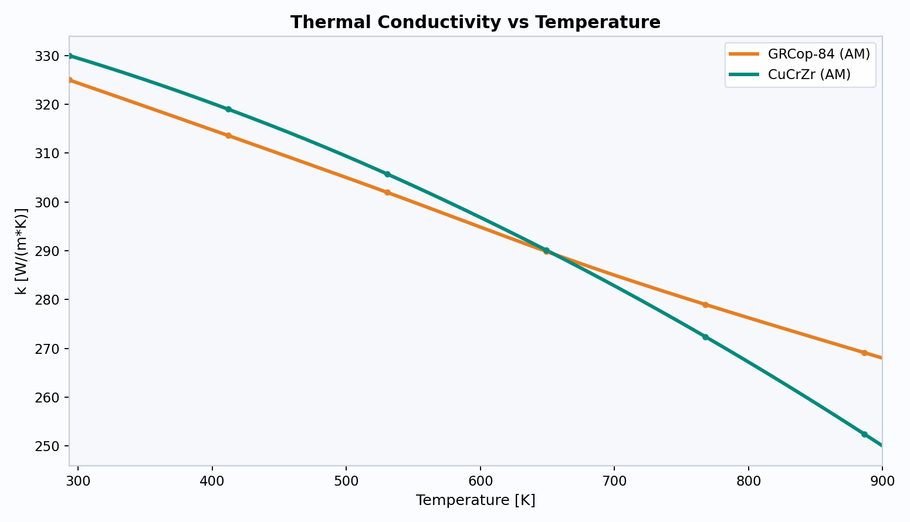
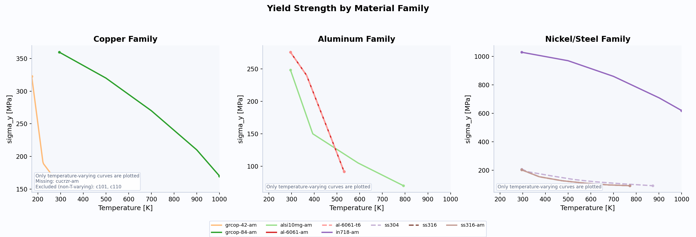
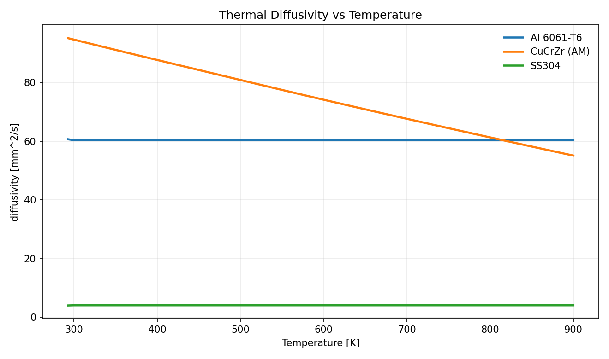
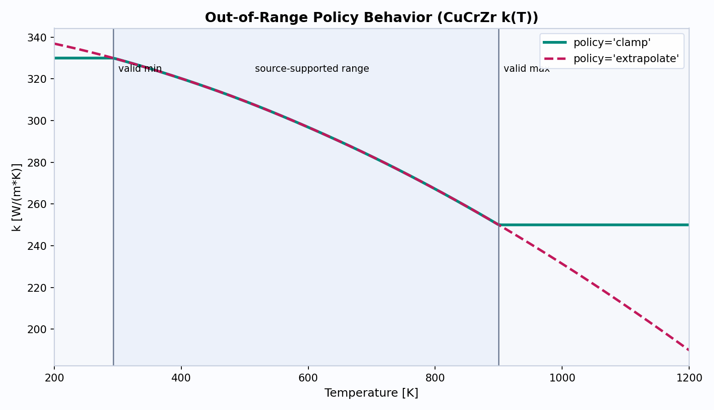

# OpenSolids

OpenSolids is a Python library for temperature-dependent solid material properties with
explicit provenance.

It is built for analysis workflows that need curves like `k(T)`, `cp(T)`,
`diffusivity(T)`, `E(T)`, `sigma_y(T)`, and `sigma_uts(T)` instead of fixed constants.

## Why OpenSolids Exists

Engineering calculations depend on properties that move with temperature and material
condition. OpenSolids was created to make those curves easy to use from Python while
keeping the source of each curve visible.

## Who It Is For

- Propulsion engineers (regen cooling, chamber/nozzle thermal-structural studies)
- Mechanical/materials engineers (strength margins and thermal stress studies)
- Students and independent builders developing thermal/structural models

## Install

```bash
pip install opensolids
```

For plot-generating examples:

```bash
pip install "opensolids[viz]"
```

For local development from this repository:

```bash
pip install -e '.[dev,viz]'
```

## Quick Start

```python
import opensolids as osl

mat = osl.material("al-6061-t6")
print(mat.k(300.0))                                   # W/(m*K)
print(mat.diffusivity(300.0, units="mm^2/s"))         # mm^2/s
print(mat.E([77.0, 293.15], units="GPa"))             # GPa
print(mat.sigma_y(293.15, units="MPa"))               # MPa
```

## Focused Material IDs

Canonical IDs for the focused set:

- `alsi10mg-am`
- `cucrzr-am`
- `grcop-84-am`
- `in718-am`
- `ss316-am`
- `al-6061-am`
- `c110`
- `c101`
- `al-6061-t6`
- `ss316`
- `ss304`

Provider-prefixed IDs remain available when you need direct source records.

Property coverage status for this set is documented in
`materials/material_sources.md` and `docs/assets/data/focus_materials_coverage.csv`.

Current source-backed status:

- `ss316` and `ss316-am` include NIST-backed `k`, `cp`, `E`, `eps_th`, and derived `diffusivity`.
- `in718-am` includes NIST-backed `k`, `eps_th` plus MIL-backed `sigma_y`, `sigma_uts`.
- `cucrzr-am` uses NTRS citation `20210010991` for thermal-property trend provenance; strength
  trend values are curated engineering entries.
- `alsi10mg-am` uses a temperature-dependent AlSi10Mg table sourced to MDPI Applied Sciences
  (DOI `10.3390/app13063460`) with room-temperature UTS anchored to NASA citation
  `20205003675`.
- `c101` uses Copper.org room-temperature `k`, `rho`, `E`, `alpha`, `sigma_y`, `sigma_uts`
  plus NIST OFHC `cp(T)`; no bundled temperature-dependent `k(T)` curve yet.
- `c110` uses Copper.org room-temperature `k`, `rho`, `E`, `alpha`, `sigma_y`, `sigma_uts`
  plus NIST OFHC `cp(T)` as a copper proxy; no bundled temperature-dependent `k(T)` curve yet.

## API Overview

- Material lookup: `osl.material(id_or_alias)`
- Search: `osl.search(query, required_properties=[...])`
- Include provider-scoped search hits: `osl.search(query, include_provider_records=True)`
- List canonical material IDs: `osl.list_material_ids()`
- Property calls:
  - `mat.k(T)`, `mat.cp(T)`, `mat.rho(T)`, `mat.E(T)`
  - `mat.sigma_y(T)`, `mat.sigma_uts(T)`
  - `mat.eps_th(T, T_ref=...)`
  - `mat.diffusivity(T)` (direct curve or derived from `k/(rho*cp)`)
- Out-of-range policy per call: `policy="clamp" | "raise" | "extrapolate"`
- Units conversion per call: `units="MPa"`, `units="GPa"`, `units="mm^2/s"`, etc.

## Units

Canonical internal units:

- `k`: `W/(m*K)`
- `cp`: `J/(kg*K)`
- `rho`: `kg/m^3`
- `diffusivity`: `m^2/s`
- `E`, `sigma_y`, `sigma_uts`: `Pa`
- `alpha`: `1/K`
- `nu`, `eps_th`: `1`

## Data Packaging and Sources

Bundled databases are included in the `opensolids` wheel:

- NIST cryogenic material records
- Curated NTRS-linked records
- Curated MIL-HDBK-5 records

Source mapping and catalogs:

- Canonical materials: `materials/canonical_materials.csv`
- Provider records: `materials/material_catalog.csv`
- Property-to-source mapping: `materials/material_sources.md`

## Visual Outputs

### Thermal conductivity comparison

Code source: `examples/05_plot_property_curves.py`



### Yield strength comparison

Code source: `examples/05_plot_property_curves.py`



### Thermal diffusivity comparison

Code source: `examples/05_plot_property_curves.py`



### Focused material set overview

Code source: `examples/09_plot_focus_materials.py`


### Out-of-range policy behavior

Code source: `examples/06_plot_policy_behavior.py`



## CLI Workflows

```bash
# Sync NIST cryogenic pages into a data-pack directory
opensolids sync nist-cryo --max-materials 10

# Sync NTRS metadata and redistribution checks
opensolids sync ntrs --since 2021-01-01 --citation-id 20070017311

# Import MIL-HDBK-5 tabular data from local PDF (pdftotext required)
opensolids import mil-hdbk-5 --pdf /path/to/MIL-HDBK-5.pdf
```

## Examples

- `examples/01_quickstart.py`
- `examples/02_units_and_policies.py`
- `examples/03_search_and_provenance.py`
- `examples/04_regen_trade_study.py`
- `examples/05_plot_property_curves.py`
- `examples/06_plot_policy_behavior.py`
- `examples/07_generate_all_visuals.py`
- `examples/08_database_workflows.py`
- `examples/09_plot_focus_materials.py`
- `examples/10_plot_multidatabase_6061.py`
- `examples/11_verify_units_and_sanity.py`
- `examples/12_export_material_catalog.py`
- `examples/13_audit_focus_material_sources.py`

Run all visual examples:

```bash
.venv/bin/python examples/07_generate_all_visuals.py
```

Refresh material/source indexes:

```bash
.venv/bin/python examples/12_export_material_catalog.py
```

## License

OpenSolids is licensed under `GPL-3.0-only`.
