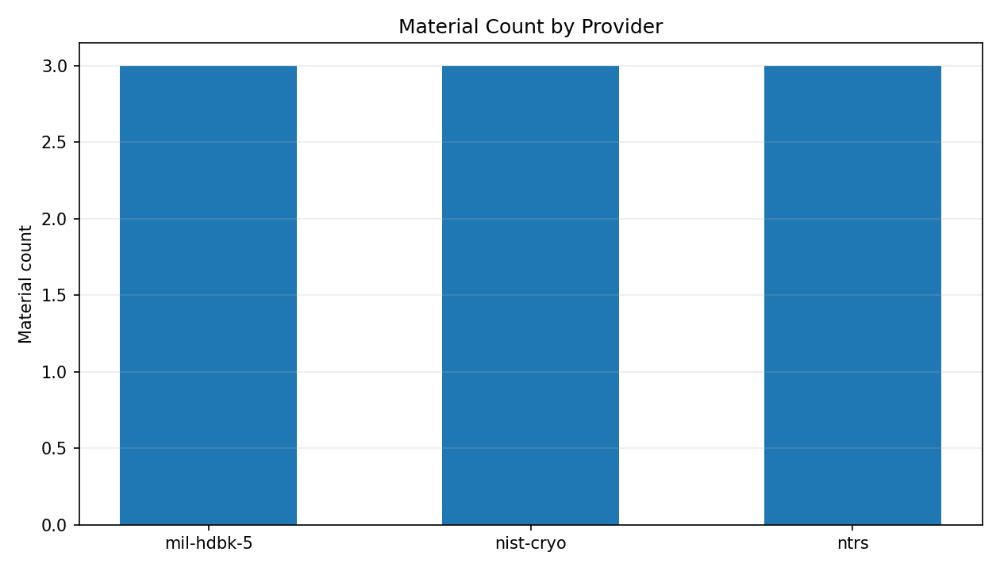
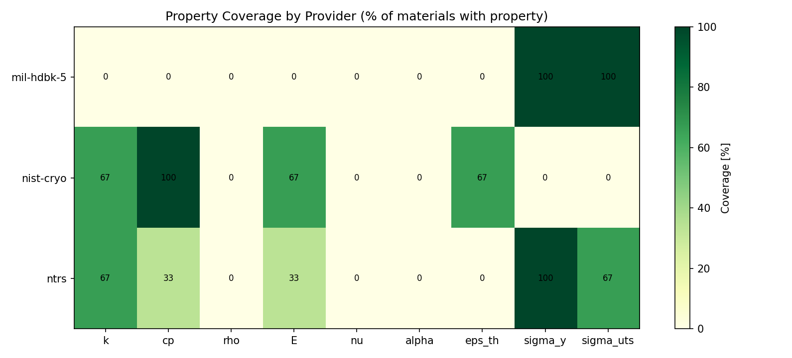
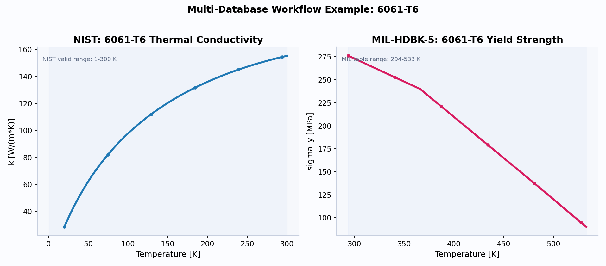

# OpenSolids Usage Guide

This guide is a practical walk-through from install to analysis output.
It includes code snippets, generated visuals, and provider/database workflows.

## 1. Install

```bash
python3 -m venv .venv
source .venv/bin/activate
pip install -e '.[dev,viz]'
```

Quick checks:

```bash
.venv/bin/python -c "import opensolids as osl; print(osl.list_providers())"
.venv/bin/pytest
```

## 2. Units and Inputs

Internal canonical units are SI.

- Temperature: `K`
- `k`: `W/(m*K)`
- `cp`: `J/(kg*K)`
- `rho`: `kg/m^3`
- `E`, `sigma_y`, `sigma_uts`: `Pa`
- `nu`, `eps_th`: dimensionless (`1`)
- `alpha`: `1/K`

Property calls accept scalar and vector temperatures.

## 3. Choose a Database (Provider)

Providers in this MVP:

- `nist-cryo`: cryogenic/room-temperature thermal + elastic curves.
- `ntrs`: curated NASA-report-derived engineering curves.
- `mil-hdbk-5`: handbook allowables style strength curves.

ID pattern by provider:

- `nist-cryo:<slug>`
- `ntrs:<citation_id>:<material_slug>`
- `mil-hdbk-5:<revision>:<material_slug>`

Example IDs:

- `nist-cryo:aluminum-6061-t6`
- `ntrs:20160001501:cucrzr`
- `mil-hdbk-5:H:inconel-718`

## 4. Basic API Usage

Source: `examples/01_quickstart.py`

```python
import opensolids as osl

mat = osl.material("nist-cryo:aluminum-6061-t6")

k_300 = mat.k(300.0)
E_vals = mat.E([77.0, 150.0, 293.15], units="GPa")
eps_120 = mat.eps_th(120.0, T_ref=293.15)

print(k_300)
print(E_vals)
print(eps_120)
```

Run:

```bash
.venv/bin/python examples/01_quickstart.py
```

Sample output:

```text
Material: nist-cryo:aluminum-6061-t6
Name: Aluminum 6061-T6
Available properties: E, cp, eps_th, k

k(300 K) = 20.903 W/(m*K)
E([77,150,293.15] K) = [69.844  67.8    63.7918] GPa
eps_th(120 K, T_ref=293.15 K) = -1.572163e-03
```

## 5. Units Conversion and Out-of-Range Policies

Source: `examples/02_units_and_policies.py`

```python
mat = osl.material("ntrs:20160001501:cucrzr")

sy_mpa = mat.sigma_y(293.15, units="MPa")
k_clamp = mat.k(1500.0, policy="clamp")
k_extrap = mat.k(1500.0, policy="extrapolate")
```

Policy options:

- `clamp` (default): pins temperature to valid range edge.
- `raise`: throws an exception when temperature is out of range.
- `extrapolate`: evaluates model outside valid range.

## 6. Database/Provider Workflow Example

Source: `examples/08_database_workflows.py`

This example demonstrates when to use each database:

- NIST for cryogenic conductivity/modulus behavior.
- NTRS for curated high-temperature copper/alloy curves.
- MIL-HDBK-5 for allowables-style strength values.

Run:

```bash
.venv/bin/python examples/08_database_workflows.py
```

Key output includes a combined design-point query using two providers for 6061:

```text
At T=295.0 K -> k from NIST: ... W/(m*K)
At T=295.0 K -> sigma_y from MIL: ... MPa
```

## 7. Visual Curves: Thermal + Strength

Source: `examples/05_plot_property_curves.py`

Run:

```bash
.venv/bin/python examples/05_plot_property_curves.py
```

### 7.1 Thermal conductivity plot


Backing data: `docs/assets/data/k_comparison_regen.csv`

| T [K] | GRCop-84 k [W/(m*K)] | CuCrZr k [W/(m*K)] |
| --- | ---: | ---: |
| 293.15 | 325.0 | 330.0 |
| 500.0 | 305.0 | 309.4 |
| 700.0 | 285.0 | 282.8 |
| 900.0 | 268.0 | 250.0 |

### 7.2 Yield strength plot


Backing data: `docs/assets/data/sigma_y_comparison_regen.csv`

## 8. Visual Policy Behavior

Source: `examples/06_plot_policy_behavior.py`

Run:

```bash
.venv/bin/python examples/06_plot_policy_behavior.py
```


Backing data: `docs/assets/data/policy_cucrzr_k.csv`

| T [K] | clamp k [W/(m*K)] | extrapolate k [W/(m*K)] |
| --- | ---: | ---: |
| 250.0 | 330.0 | 333.4 |
| 293.15 | 330.0 | 330.2 |
| 900.0 | 250.2 | 250.2 |
| 1100.0 | 250.0 | 211.3 |

## 9. Visual Provider Coverage (Different Databases)

Source: `examples/09_plot_provider_coverage.py`

Run:

```bash
.venv/bin/python examples/09_plot_provider_coverage.py
```

### 9.1 Materials per provider



### 9.2 Property coverage heatmap



Backing CSV files:

- `docs/assets/data/provider_material_counts.csv`
- `docs/assets/data/provider_property_coverage.csv`

## 10. Visual Multi-Database 6061 Workflow

Source: `examples/10_plot_multidatabase_6061.py`

This script shows combining two databases for one alloy:

- NIST `k(T)` for 6061-T6 thermal behavior.
- MIL-HDBK-5 `sigma_y(T)` for 6061-T6 strength allowables.

Run:

```bash
.venv/bin/python examples/10_plot_multidatabase_6061.py
```

Output plot:



Backing CSV files:

- `docs/assets/data/al6061_nist_k.csv`
- `docs/assets/data/al6061_mil_sigma_y.csv`

## 11. Search and Provenance

Source: `examples/03_search_and_provenance.py`

```python
import opensolids as osl

hits = osl.search("inconel")
for hit in hits:
    print(hit.id, hit.name, hit.provider)

mat = osl.material("ntrs:20160001501:cucrzr")
for src in mat.sources:
    print(src.source_id, src.title, src.url_or_citation_id)
```

Use provenance fields before using curves in reports or design decisions.

## 12. CLI Data Workflows

### Sync NIST

```bash
opensolids sync nist-cryo --max-materials 20
```

### Sync NTRS metadata + redistribution checks

```bash
opensolids sync ntrs --since 2021-01-01 --citation-id 20070017311
```

### Import MIL-HDBK-5 local table

```bash
opensolids import mil-hdbk-5 --pdf /path/to/MIL-HDBK-5.pdf
```

## 13. Generate All Documentation Visuals

```bash
.venv/bin/python examples/07_generate_all_visuals.py
```

Generates/refreshes files in:

- `docs/assets/plots/`
- `docs/assets/data/`

## 14. Best Practices

- Use `policy="raise"` in strict validation pipelines.
- Use `policy="clamp"` in broad design sweeps.
- Check `mat.available_properties()` before optional calls.
- Catch `KeyError` when iterating heterogeneous materials.
- Inspect `mat.sources` and compliance notes before publication use.

## 15. Known MVP Limits

- Coverage is starter-level and incomplete across materials/properties.
- NTRS is metadata-first with curated numeric subsets.
- MIL PDF import is intentionally minimal and expects parseable table text.

## 16. Additional References

- PRD summary: `docs/prd/README.md`
- Compliance notes: `docs/compliance/`
- Example index: `examples/README.md`
